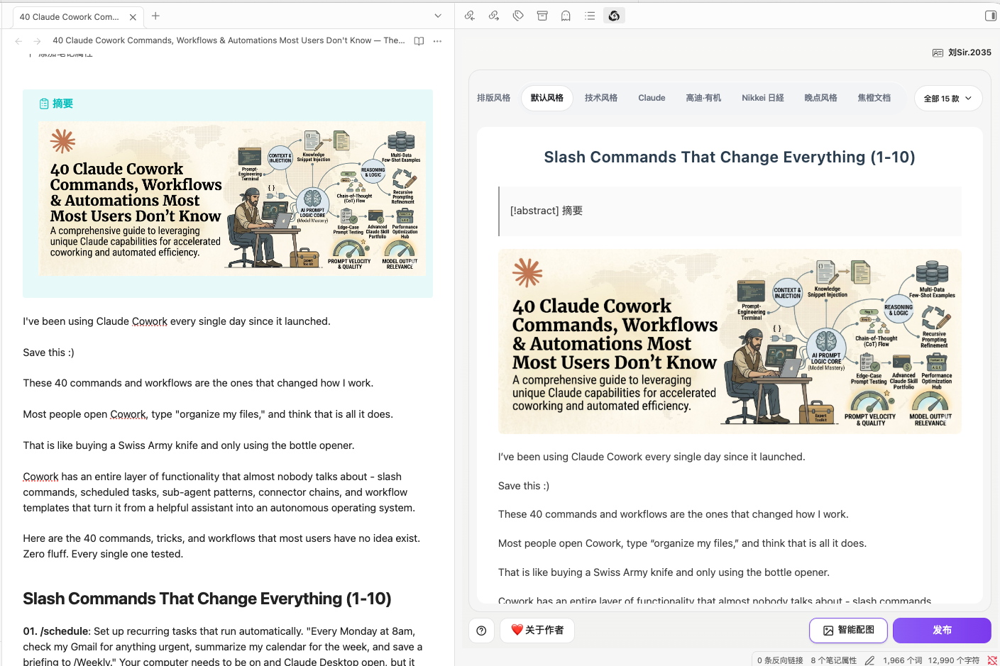
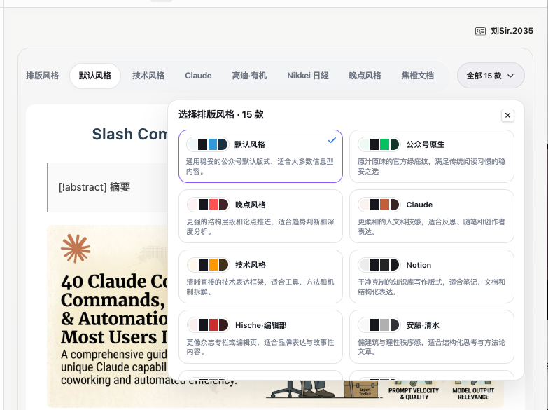
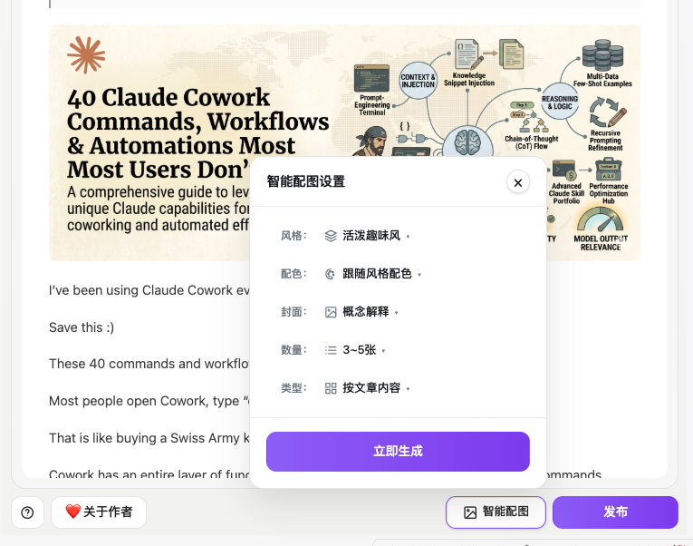
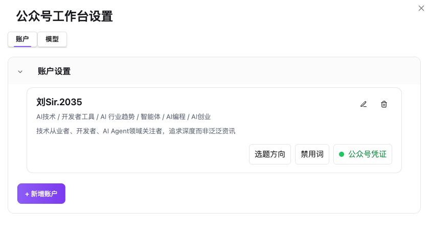

# 公众号编排智能体

> 一个面向微信公众号创作者的 Obsidian 插件：根据文章内容完成公众号排版预览、封面与正文配图生成，并发布到公众号草稿箱。
> 

## 功能特点

- 根据文章内容生成公众号排版预览。
- 支持多种公众号排版风格，适配不同类型文章。
- 支持封面图生成，可按文章主题匹配封面类型、情绪强度、字体风格、文字层级和画幅比例。
- 支持正文图生成，可自动规划插图位置、图片数量、视觉结构和配图内容。
- 支持单张图片重新生成和删除。
- 支持发布到微信公众号草稿箱。
- 支持配置 LLM 和生图模型。

## 界面预览

> 页面截图可根据实际界面替换。

## 使用方法

### 1. 处理文章

根据文章内容，选择不同排版风格、生成封面与正文图，并发布到公众号草稿箱。

工作台会读取当前文章内容，生成公众号预览，并提供排版、配图和发布能力。

### 2. 选择排版风格

预览区顶部提供排版风格选择。

插件内置多种公众号排版风格，可适配技术解析、深度阅读、产品介绍、轻量短文等不同文章气质。切换风格后，可以直接查看文章在不同公众号样式下的阅读效果。

### 3. 生成封面与正文图

「智能配图」用于根据文章内容生成封面图和正文配图。

插件会根据文章内容自动规划插图位置，生成封面图与正文配图，并插入到文章中。

### 4. 调整单张图片

生成后的图片会显示在预览中。

每张图片都支持重新生成和删除。封面重新生成时，可调整封面类型、情绪强度、字体风格、文字层级和画幅比例；正文图重新生成时，可调整图片风格和配色。

### 5. 发布到公众号草稿箱

确认预览效果后，可将文章发布到微信公众号草稿箱。

插件会自动处理文章图片，并调用微信公众号接口创建草稿箱文章。

## 安装方式

### 手动安装

1. 从 GitHub Release 下载发布包。
2. 解压后确认目录中至少包含以下 3 个文件：
   - `manifest.json`
   - `main.js`
   - `styles.css`
3. 在你的 Obsidian vault 中创建插件目录：
   - `.obsidian/plugins/wechat-article-obsidian/`
4. 将 `manifest.json`、`main.js`、`styles.css` 放入该目录。
5. 重启 Obsidian，或在 Obsidian 设置中重新加载社区插件。
6. 在 Obsidian 设置中启用「公众号编排智能体」。

## 使用前准备

### Obsidian

- Obsidian 1.6.0 或以上版本。
- 桌面端环境。

### AI 能力

- 可用的 LLM 配置。
- 可用的生图模型配置。

### 微信发布

- 微信公众号接口配置。
- 具备创建草稿箱文章所需权限。

### 账户配置

发布到微信公众号草稿箱前，需要先在插件设置中创建账户。

1. 打开 Obsidian 设置，进入「公众号编排智能体」。
2. 在「账户」页点击「新增账户」。
3. 填写基础信息：
   - 名称：用于顶部作者选择和发布作者名，例如 `刘Sir.2035`。
   - 行业：用于描述账号主要内容领域，例如 `AI 技术 / 开发者工具 / 智能体`。
   - 目标受众：用于描述文章面向的人群，例如 `技术从业者、开发者、AI Agent 关注者`。
4. 保存后，在账户卡片中点击「公众号凭证」。
5. 填写微信公众号后台的 `AppID` 和 `AppSecret`。

没有配置账户或公众号凭证时，插件仍可用于排版预览和配图生成，但不能发布到公众号草稿箱。

## 适合人群

- 使用 Obsidian 写公众号文章的创作者。
- 需要将 Markdown 文章发布到微信公众号草稿箱的作者。
- 需要为文章生成封面和正文配图的内容创作者。
- 希望在发布前预览公众号排版效果的写作者。

## 配置说明

### 图片风格

| 风格 | 简单说明 | 适用场景 |
| --- | --- | --- |
| 技术蓝图风 | 蓝图、结构线、工程感强，强调系统结构和模块关系 | 技术架构、系统设计、工程方案 |
| 黑板手绘风 | 黑板质感、粉笔线条、教学感明显 | 教程、知识讲解、课堂式内容 |
| 杂志信息图风 | 信息密度较高，强调数据、标题和模块化排版 | 数据分析、报告解读、趋势文章 |
| 优雅杂志风 | 留白、精致排版、轻 editorial 气质 | 深度阅读、观点文章、品牌内容 |
| 幻想动画风 | 色彩更鲜明，带动画与想象力表达 | 创意内容、概念解释、轻松科普 |
| 现代扁平插画风 | 扁平图形、清晰块面、现代感强 | 产品介绍、SaaS、效率工具 |
| 扁平涂鸦风 | 涂鸦线条、轻松表达、视觉亲和 | 轻量短文、读者友好型内容 |
| 墨迹笔记风 | 手写、墨迹、笔记感，偏个人表达 | 方法论、思考笔记、复盘文章 |
| 直觉机器风 | 机械结构、抽象装置、偏实验表达 | AI、系统思考、复杂概念 |
| 极简留白风 | 元素少、留白大、表达克制 | 观点文章、标题型视觉、安静阅读 |
| 自然生态风 | 自然色彩、植物与生态隐喻 | 组织、成长、长期主义、生态类主题 |
| 极简手绘线条风 | 简单线稿、低视觉噪音、易读 | 概念解释、轻量教程、读者引导 |
| 像素插画风 | 像素图形、复古游戏感 | 工具介绍、开发者内容、轻松技术文 |
| 活泼趣味风 | 轻松、有趣、可爱，强调亲和力 | 轻量科普、工具推荐、读者友好型内容 |
| 复古印刷风 | 旧报纸、印刷纹理、复古质感 | 历史回顾、文化评论、叙事内容 |
| 学术精确图表风 | 精确、克制、图表化，强调可信度 | 学术解释、研究摘要、数据结论 |
| 丝网印刷风 | 强对比、块面感、海报式表达 | 宣言、观点、强主题传播 |
| 草图速写风 | 草稿感、手绘线条、结构推演 | 设计思考、方案探索、早期概念 |
| 手绘笔记风 | 手账、笔记、标注感强 | 学习笔记、教程、方法总结 |
| 矢量插画风 | 干净矢量、层次清晰、适配性强 | 通用正文图、产品解释、流程说明 |
| 复古质感风 | 暖色、颗粒、旧纸感 | 叙事、历史、文化型文章 |
| 温暖亲和风 | 柔和、温暖、低攻击性 | 个人经验、成长故事、读者陪伴 |
| 水彩柔和风 | 水彩质感、色彩柔和、情绪轻 | 情绪表达、生活化内容、柔和科普 |

### 配色方案

| 配色 | 简单说明 | 适用场景 |
| --- | --- | --- |
| 跟随风格配色 | 使用所选图片风格默认配色 | 不需要额外控制颜色时 |
| macaron（马卡龙） | 柔和、轻快、低饱和 | 轻松科普、教育内容、亲和型文章 |
| mono-ink（黑白墨线） | 黑白线稿、克制、清晰 | 技术解析、结构图、严肃内容 |
| neon（霓虹） | 高亮、科技感、视觉冲击强 | AI、未来感、工具和技术主题 |
| warm（暖调） | 暖色、柔和、阅读友好 | 叙事、观点、个人经验文章 |

### 封面类型

| 类型 | 简单说明 | 适用场景 |
| --- | --- | --- |
| 焦点视觉 | 用一个强主视觉承载文章主题 | 主题明确、需要强传播感的文章 |
| 概念解释 | 用图形解释文章核心概念 | 方法论、教程、知识解释 |
| 标题主导 | 以标题文字作为主要视觉 | 观点文章、短文、标题本身有传播力的内容 |
| 隐喻表达 | 用隐喻画面表达抽象主题 | 深度思考、行业观察、复杂概念 |
| 场景氛围 | 通过具体场景营造文章情绪 | 叙事、体验、生活化或工作流文章 |
| 极简留白 | 少元素、大留白、突出克制感 | 深度阅读、安静表达、品牌感内容 |

### 封面细节

| 属性 | 可选项 | 说明 |
| --- | --- | --- |
| 情绪强度 | 克制、均衡、强烈 | 控制封面整体视觉张力、对比度和饱和度 |
| 字体风格 | 清爽现代、手写亲和、优雅衬线、醒目标题 | 控制封面文字气质 |
| 文字层级 | 无文字、仅标题、标题+副标题、信息丰富 | 控制封面中出现的文字信息量 |
| 画幅比例 | 按配置提供 | 控制封面输出比例，适配公众号封面展示 |

### 正文图类型

| 类型 | 简单说明 | 适用场景 |
| --- | --- | --- |
| 按文章内容 | 由模型根据文章内容自动选择图形结构 | 不确定具体图形类型时 |
| 数据图 | 用区域、标签和数字组织信息 | 数据、指标、报告、趋势分析 |
| 场景图 | 用具体场景表达文章段落含义 | 叙事、经验、场景化解释 |
| 流程图 | 用步骤串联过程 | 教程、工作流、操作步骤 |
| 对比图 | 用左右或前后结构表达差异 | 方案对比、前后变化、观点对照 |
| 框架图 | 用节点和关系表达系统结构 | 方法论、架构、模型分析 |
| 时间线 | 按时间顺序展示事件变化 | 历史、演进、里程碑 |

### 正文图数量

| 选项 | 简单说明 | 适用场景 |
| --- | --- | --- |
| 1~2 张 | 只保留最关键的插图位置 | 短文、轻量内容、低干扰阅读 |
| 3~5 张 | 平衡内容密度和阅读节奏 | 中长文、教程、方法论文章 |
| 按章节 | 根据章节结构分配图片 | 结构清晰、标题层级明确的文章 |
| 全文 | 尽量覆盖更多可视化位置 | 长文、系统性教程、图文型文章 |
| 不生成正文图 | 不生成正文配图 | 只需要排版或只生成封面时 |

### 单图重新生成

| 图片类型 | 可调整项 | 说明 |
| --- | --- | --- |
| 封面图 | 图片风格、配色、封面类型、情绪强度、字体风格、文字层级、画幅比例 | 保留原文章语义，只替换当前封面图 |
| 正文图 | 图片风格、配色 | 保留原 prompt 语义，只替换当前正文图 |

### 文件产物

| 产物 | 说明 |
| --- | --- |
| 图片文件 | 生成的封面图和正文图文件 |
| prompt 记录 | 图片生成使用的最终 prompt JSON |
| 过程记录 | 文章分析、配图规划和图像生成过程中的结构化记录 |
| 文章副本 | 用于测试或回写验证的文章副本 |

